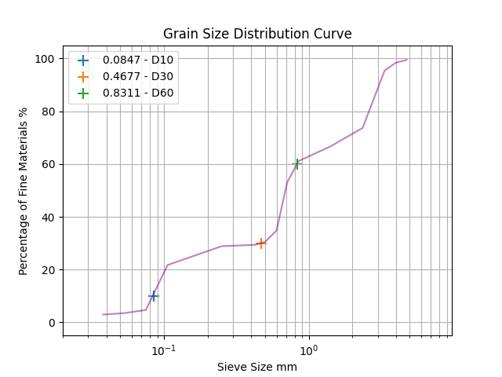

* In **Sieve Analysis Test** it is required to find Particles Diameter of soil sample that pass 10%, 30% and 60% .
so according to accuracy Shapely provide very good gemoetric calculations for find intersections between lines.

> **Example:**

* Retained random values to test the scripts,
* Pass new Values to *Book1.xlsx* excel file to find new intersections.



#### Shapely Code Tutorial to find lines intersections
```python
from shapely.geometry import LineString
line1 = LineString(np.column_stack((xs, ys)))
P10 = LineString(np.column_stack((xs, np.ones_like(xs)*10)))
# np.ones_like(xs)*10 ie; Trick to get identical Array of xs but values equal to 10 

point = line1.intersection(P10) # intersection Point

xvalue = point.x # x value
yvalue = point.y # y value
xyvalue = point.xy # (x,y) tuple form
```
